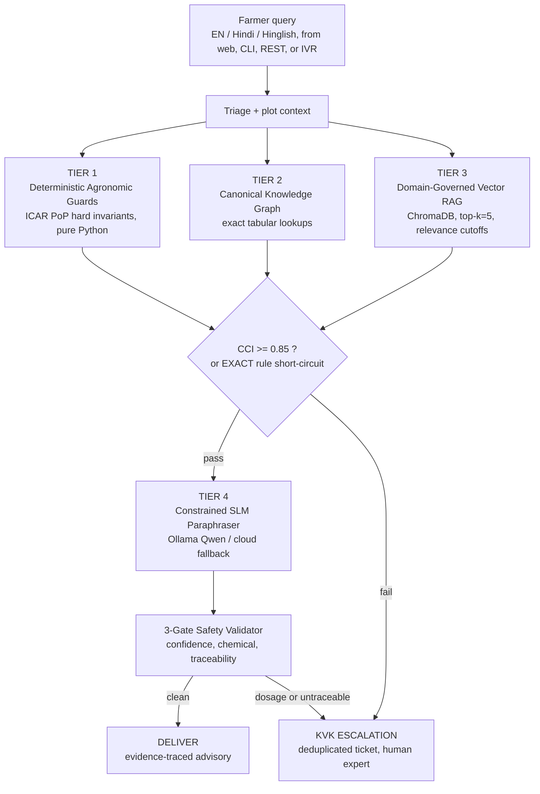
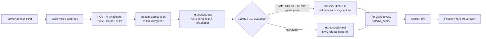

<div align="center">

# 🌾 KrishiSetu AI (कृषिसेतु)

### Autonomous 4-Tier Hybrid Agronomic Advisory & PMFBY Crop Loss Assessment Engine

**Smart India Hackathon 2026 · Problem Statement SIH26193 · Team ELEUSIAN**

[](https://www.sih.gov.in/)
[](#team--compliance)
[](https://www.python.org/)
[](https://fastapi.tiangolo.com/)
[](#repository-verification--test-suite)
[](LICENSE)
[](docs/06-SAFETY-AND-CONFIDENCE.md)

[Architecture](docs/01-ARCHITECTURE.md) · [Safety Contract](docs/06-SAFETY-AND-CONFIDENCE.md) · [Benchmarks](docs/11-BENCHMARKS.md) · [Roadmap](docs/12-ROADMAP.md) · [Setup](SETUP.md) · [Demo Script](commands.py)

</div>

---

## Video Demonstrations

| Demo 01: Core Engine & System Architecture | Demo 2.0: Live Voice IVR & Vernacular Telephony |
|:---:|:---:|
| [](https://youtu.be/TYNPMGsC2zw) | **Demo 2.0 Video URL**<br>Placeholder: insert the final demo link before evaluation |
| The 4-tier decision core, the CCI confidence gate, the three-gate safety validator, and the CLI advisory flow. | A live Twilio call: Hindi speech in, safety-gated Bhashini voice out, and the KVK escalation hand-off on uncertain queries. |

---

## The Core Challenge

India's 100M+ smallholder farmers face high-stakes agronomic questions every week: when to irrigate, whether to spray before a heavy-rain warning, what is causing the yellowing leaves. The answers exist in IMD weather alerts, Soil Health Cards, ICAR Packages of Practices, and KVK advisories, but they are scattered across portals and PDFs that a farmer on a 2G feature phone cannot reach.

A generic generative LLM is the wrong instrument for this domain. It invents pesticide dosages, cites nothing, and cannot be held accountable. A single hallucinated "2.5 ml/L chlorpyrifos" recommendation can destroy a crop, a season, and a household's income.

## Architectural Thesis: Safe by Construction

KrishiSetu AI inverts the standard "LLM at the center" design. Facts are produced by deterministic rules, canonical documents, and governed retrieval. The language model only paraphrases what those tiers already decided, and every answer must clear a numerical confidence gate plus three hard safety validators before it can leave the system. When the system is not certain, it does not guess: it escalates to a human KVK expert.

| Guarantee | Enforcement |
|---|---|
| The LLM never originates advice | Tier 4 is a paraphraser: its prompt contains only Tier 1-3 output, and its response must parse to a schema that has no dosage field at all |
| Never below-threshold guessing | Composite Confidence Index gates delivery at 0.85; anything lower is withheld and escalated |
| Zero chemical-dosage output | Gate 2 strips any active-ingredient + dosage pair, substitutes a region-verified input class, and escalates regardless of confidence |
| Every claim is traceable | Gate 3 requires a Tier-1 rule id, Tier-2 doc id, or Tier-3 chunk id on every action; untraceable claims are stripped, and an all-stripped advisory escalates |
| Generate, never submit | PMFBY crop-loss reports are produced for farmer review; no code path reaches any insurance portal |

These are not prompts asking a model to behave. They are hard gates in the pipeline (`krishisethu/safety/gates.py`) that run on every response, on every channel: CLI, REST, and voice.

---

## The 4-Tier Decision Hierarchy



| Tier | Name | What it does | Why it cannot hallucinate |
|---|---|---|---|
| **1** | Deterministic Agronomic Guards | Weather-to-action matrices, spray windows, deficit irrigation, and ratoon/gap planning as pure Python, zero model calls | Identical inputs always produce identical outputs; every action carries a rule trace code |
| **2** | Canonical Knowledge Graph | ICAR PoP, MSP, spacing, and scheme-eligibility facts as Markdown + YAML frontmatter, loaded by exact metadata lookup | Never chunked, never embedded, never vectorized; supersession chains and authority-rank conflict resolution mean expired facts are never served |
| **3** | Domain-Governed Vector RAG | Long-tail KVK Q&A, ICAR circulars, and state advisories in ChromaDB with bge-m3 1024-d multilingual embeddings | Metadata-filter-first retrieval (crop, district, season, source_type), a hard top-k=5 cap, and relevance cutoffs; a sugarcane query can never retrieve a rice chunk |
| **4** | Constrained SLM Paraphraser | Local Ollama Qwen3.5-4B/2B reformulates Tier 1-3 output by default; a hybrid cloud pool (NVIDIA NIM, Groq, OpenRouter) with key-rolling and a PII guard serves it when configured, with clean local fallback | Receives only Tier 1-3 content; must emit schema-valid JSON with evidence refs, or the response is rejected; explanation only, zero fact generation |

### Mathematical Safety Gate: Composite Confidence Index

```text
CCI = 0.50 * R + 0.30 * S_RAG + 0.20 * P_vision
```

- `R` is the Tier-1 rule-match indicator: 1.0 on exact resolution, a normalized partial score in (0,1), 0.0 unresolved
- `S_RAG` is the maximum cosine similarity between the query and the top-k retrieved chunks (0.0 when retrieval is skipped)
- `P_vision` is the vision softmax of the top class (0.0 until the Phase 3 vision tier lands)
- Without an image, the weights renormalize to (0.625, 0.375, 0.0), preserving the 5:3 rule-to-RAG ratio

> **Delivery invariant:** an advisory is delivered only when `CCI >= 0.85`, or when the query resolved EXACTLY in Tier 1 with zero probabilistic components (the deterministic short-circuit, so a rule-certain answer is never spuriously escalated). Any lower score triggers deterministic KVK (Krishi Vigyan Kendra) escalation: the farmer receives a neutral hand-off, the full decision context goes to the officer, and the system abstains rather than guesses.

Escalation tickets are deduplicated by `sha256(query + plot_id + date_window)`, so a replayed briefing never double-tickets, and the farmer channel only ever sees the neutral hand-off message.

---

## Vernacular Telephony Subsystem (Twilio + Bhashini IVR)

A farmer with a feature phone calls the Twilio number and speaks Hindi. The voice channel is not a bolt-on chatbot: it runs the exact same safety-gated pipeline as the CLI and the REST API, constructed through one shared factory (`krishisethu/pipeline/factory.py`), so no channel can build a shortcut path around the CCI gate or the three-gate SafetyValidator.



**Call flow, end to end:**

1. `POST /ivr/incoming` answers with TwiML: a Hindi greeting and `<Gather input="speech" language="hi-IN" speechTimeout="auto" actionOnEmptyResult="true">`.
2. Twilio posts the recognized speech (`SpeechResult`, `CallSid`) to `POST /ivr/gather`.
3. The gather route dispatches the query through the full LangGraph decision pipeline in a threadpool, so the synchronous core never blocks the event loop while other webhooks keep answering.
4. The CCI gate and the three-gate SafetyValidator decide the outcome. On the safe path, the validated advisory actions are synthesized into Hindi speech by the async Bhashini STT/TTS service (`krishisethu/api/services/bhashini.py`). On the escalated path (fail_cci, dosage violation, or all claims stripped), the caller hears only the hardcoded neutral Hindi KVK referral hand-off: the escalation branch never reads the advisory, so zero withheld tokens can leak into speech by construction.
5. The reply WAV is isolated per call and played back through TwiML `<Play>`.

**Race-condition prevention.** Every reply is written to `data/ivr_audio/{CallSid}.wav`. The standalone prototype used one shared audio file, so concurrent calls overwrote each other's replies; per-CallSid isolation removes the race. An invalid or missing CallSid gets a freshly minted UUID token instead of a shared filename.

**Traversal security.** The audio route accepts only `^[A-Za-z0-9_-]{8,64}$` (the Twilio CallSid shape) and returns 404 for anything else, so path-traversal ids such as `..%2Fsecrets` are rejected before the filesystem is touched. Audio is served with `Cache-Control: no-store`.

**Failure behavior.** TTS failure returns a spoken Hindi apology, never an ungated answer. An empty speech result retries without invoking the pipeline. A poisoned advisory on the escalation branch is regression-tested to never reach TTS.

---

## Repository Verification & Test Suite

**255 tests passing, 1 skipped** (the 249-test IVR milestone plus the REST advise endpoint and core-coverage tests added during the documentation audit). The suite is hermetic: no network, no Ollama daemon, and no Twilio or Bhashini keys are required. It spans unit tests, pipeline invariants, poisoned-advisory regressions, golden-set adversarial verdicts, and async API/IVR routes.

| Suite | What it proves |
|---|---|
| `tests/test_rules.py` | Tier-1 determinism: every sprayOK boolean combination, the Sohna weather matrix, irrigation arithmetic, ratoon thresholds, R(C) |
| `tests/test_knowledge.py` | Tier-2 exact lookup; expired and superseded documents are never served |
| `tests/test_rag.py` | Cross-crop contamination canary, top-k=5 cap, idempotent ingestion, provenance on every chunk |
| `tests/test_confidence.py` | CCI arithmetic, the 0.85 boundary, the exact short-circuit, no-image weight renormalization |
| `tests/test_safety_validator.py` | 0% dosage survival across unit spellings and regional actives, traceability stripping, attacker dose requests |
| `tests/golden_set/` | Adversarial fixtures in four categories (ICAR-answerable, ambiguous/OOD, malicious-dosage, cross-crop), each with an expected DELIVER/ESCALATE verdict |
| `tests/test_pipeline.py` | End-to-end Sohna story, malicious dosage escalation, OOD escalation, latency telemetry |
| `tests/test_ivr_api.py` | 11 webhook tests: escalation speech lock (a poisoned advisory never reaches TTS), TTS failure, path traversal, Bhashini client |
| `tests/test_api.py` | Async REST routes: `/api/v1/advise` delivery and escalation leak-proofing, status and health |
| `tests/test_hybrid_router.py` | Cloud key pooling, key-rolling on 429/401/timeout, PII guard, local fallback |
| `tests/test_ndvi.py`, `tests/test_report.py`, `tests/test_escalation.py` | NDVI band math and cloud masking, PMFBY report generation, ticket idempotency |

**Deterministic core coverage: 100%** (427/427 statements across the Tier-1 rules, the CCI composite index, the three-gate SafetyValidator, and the KVK escalation service, measured with pytest-cov).

Run the suite and verify all gates locally:

```powershell
.\.venv\Scripts\activate

python -m pytest -q                          # full suite: 255 passed, 1 skipped
python -m pytest tests/golden_set -q         # adversarial DELIVER/ESCALATE verdicts
python -m pytest tests/test_ivr_api.py -q    # 11 hermetic IVR webhook tests

# 100% deterministic-core coverage:
python -m pytest tests/test_rules.py tests/test_confidence.py tests/test_safety_validator.py tests/test_escalation.py --cov=krishisethu.rules --cov=krishisethu.confidence --cov=krishisethu.safety --cov=krishisethu.escalation --cov-report=term

# Safety gates end to end from the CLI:
python -m krishisethu.cli demo
python demo.py
```

---

## Quickstart

Prerequisites: Python 3.11+ and the Ollama desktop app running at `http://localhost:11434`. Full environment detail lives in [SETUP.md](SETUP.md).

```powershell
python -m venv .venv
.venv\Scripts\activate
python -m pip install --upgrade pip
python -m pip install -e ".[dev]"            # dependencies from pyproject.toml
Copy-Item .env.example .env

# Pull the local models (PowerShell, not Git Bash):
& "$env:LOCALAPPDATA\Programs\Ollama\ollama.exe" pull qwen3.5:4b
& "$env:LOCALAPPDATA\Programs\Ollama\ollama.exe" pull qwen3.5:2b
& "$env:LOCALAPPDATA\Programs\Ollama\ollama.exe" pull bge-m3:567m

python scripts/verify_setup.py               # exit 0 = ready
```

Optional: set one cloud key (`NVIDIA_API_KEY_1`, `GROQ_API_KEY_1`, or `OPENROUTER_API_KEY_1`) in `.env` to exercise the hybrid cloud router; with none set, everything runs locally on Ollama. For the voice channel, set `BHASHINI_INFERENCE_API_KEY` and point Twilio's incoming-call voice URL at `POST /ivr/incoming`.

### CLI

```powershell
# Weekly advisory on the Sohna demo profile (Tier-1 EXACT path):
krishisethu advise -q "Heavy rain is forecast for my sugarcane field in grand growth - what should I do this week?" --plot-id sohna-demo --demo --verbose

# Hindi/Hinglish query that must escalate (never guessed):
krishisethu advise -q "Zinc spray karna hai kya?" --plot-id sohna-demo --demo

# PMFBY crop-loss assessment PDF (generated, never submitted):
krishisethu report --plot-id sohna-demo -o report.pdf

# Full Sohna demo story with per-beat gate telemetry:
krishisethu demo
```

The exact 4-scenario video-demo command sequence is scripted in [commands.py](commands.py), and `python demo.py` runs the architecture smoke test (safety backbone, Tier 1, Tier 3 retrieval, localization).

### FastAPI Service

```powershell
python -m uvicorn krishisethu.api.main:app --host 127.0.0.1 --port 8000
```

| Method | Endpoint | Purpose |
|---|---|---|
| `POST` | `/api/v1/advise` | Run a query through the safety-gated 4-tier pipeline (JSON in, JSON out) |
| `POST` | `/ivr/incoming` | Twilio voice webhook: Hindi greeting + speech gather (hi-IN) |
| `POST` | `/ivr/gather` | Route recognized speech through the pipeline; returns TwiML |
| `GET` | `/ivr/audio/{call_sid}` | Serve the per-call Bhashini WAV (CallSid-guarded, `no-store`) |
| `GET` | `/api/v1/status` | Settings summary, Ollama reachability, IVR configuration flags |
| `GET` | `/health` | Liveness probe |

```bash
curl -X POST http://127.0.0.1:8000/api/v1/advise \
  -H "Content-Type: application/json" \
  -d '{"query": "Heavy rain is forecast for my sugarcane field in grand growth - what should I do this week?", "plot_id": "sohna-demo", "demo": true}'
```

Verified delivery response (live run against the local pipeline):

```json
{
  "escalate": false,
  "output": "Suspend irrigation\nClear furrow outlets\nDelay foliar spray 72h",
  "actions": [
    {"text": "Suspend irrigation", "source_id": "WEATHER:sugarcane:grand_growth:heavy_rain_warning:SUSPEND_IRRIGATION"},
    {"text": "Clear furrow outlets", "source_id": "WEATHER:sugarcane:grand_growth:heavy_rain_warning:CLEAR_FURROW"},
    {"text": "Delay foliar spray 72h", "source_id": "WEATHER:sugarcane:grand_growth:heavy_rain_warning:DELAY_FOLIAR_SPRAY"}
  ],
  "cci": 0.8765,
  "gate_outcome": "pass_exact",
  "trace_id": "e2226617-fe70-4360-85dc-97f4a7845020",
  "ticket_id": null
}
```

Verified escalation response (same server, low-confidence query):

```json
{
  "escalate": true,
  "output": "This query has been forwarded to a KVK agricultural expert for review. You will receive guidance shortly.",
  "actions": [],
  "cci": 0.1693,
  "gate_outcome": "fail_cci",
  "trace_id": "5eee9b91-6087-4116-bc94-7a9df23b36dc",
  "ticket_id": "KVK-C8F2F75E726D"
}
```

On escalation, `actions` is always empty: the withheld advisory is never serialized to the client.

---

## Evidence & Reporting Extensions

- **Sentinel-2 NDVI engine** (`krishisethu/evidence/ndvi.py`): B08/B04 band math, SCL cloud masking (classes 3, 8, 9, 10), and anomaly severity classification. The Sohna flood scenario reproduces a baseline of 0.79 dropping to an observed 0.44, a delta of -0.35 classified as severe (44.3% drop).
- **PMFBY crop-loss report** (`krishisethu/pipeline/report.py`): renders an insurance-ready assessment PDF for farmer review. Generate-never-submit is enforced as code: there is no path to any insurance portal, bank, or insurer.
- **Offline queue** (`krishisethu/pipeline/`): connectivity-poor regions queue report generation locally and drain it when the network returns.
- **Hybrid cloud-local Tier 4** (`krishisethu/renderer/router.py`): up to 10 pooled cloud keys (4x NVIDIA NIM, 4x Groq, 2x OpenRouter) with automatic key-rolling on 429/401/timeout, a PII guard before any cloud call (farmer data never leaves the machine), and clean fallback to local Ollama. The system runs fully offline.
- **Deduplicated KVK escalation** (`krishisethu/escalation/kvk_ticket.py`): tickets keyed by `sha256(query + plot_id + date_window)`; the farmer channel receives only the neutral hand-off, the officer receives the full context.

---

## Repository Map

```text
KrishiSetu_AI/
├── krishisethu/
│   ├── rules/          Tier 1: deterministic rule engine (pure Python, no model calls)
│   ├── knowledge/      Tier 2: canonical knowledge, exact metadata lookup
│   ├── rag/            Tier 3: domain-governed vector RAG (ChromaDB + bge-m3)
│   ├── renderer/       Tier 4: paraphraser, hybrid cloud-local router, translation
│   ├── confidence/     CCI composite confidence index
│   ├── safety/         three-gate validator + chemical registry
│   ├── escalation/     KVK ticket service (sha256-deduplicated)
│   ├── evidence/       Sentinel-2 NDVI engine
│   ├── pipeline/       LangGraph orchestration, shared channel factory, PMFBY report, offline queue
│   ├── api/            FastAPI: REST advise + Twilio IVR webhooks + Bhashini service
│   ├── domain/         typed enums and Pydantic models
│   └── cli.py          krishisethu advise | demo | report
├── knowledge/          canonical Tier-2 docs + Tier-3 RAG corpus
├── tests/              255-test hermetic suite + golden set
├── docs/               architecture, safety, benchmarks, roadmap, developer environment
├── commands.py         scripted 4-scenario video demo
├── demo.py             architecture smoke test
└── LICENSE             MIT
```

---

## Team & Compliance

**Team ELEUSIAN** | Smart India Hackathon 2026 | Problem Statement **SIH26193**

Licensed under the [MIT License](LICENSE).

> **PMFBY boundary and advisory disclaimer:** KrishiSetu AI generates advisory output and crop-loss assessment reports for the farmer's review. It never submits an insurance claim and does not interface with PMFBY portals, banks, or insurers; submission is always a documented human action. Advisory output is not a substitute for professional agronomic advice.
